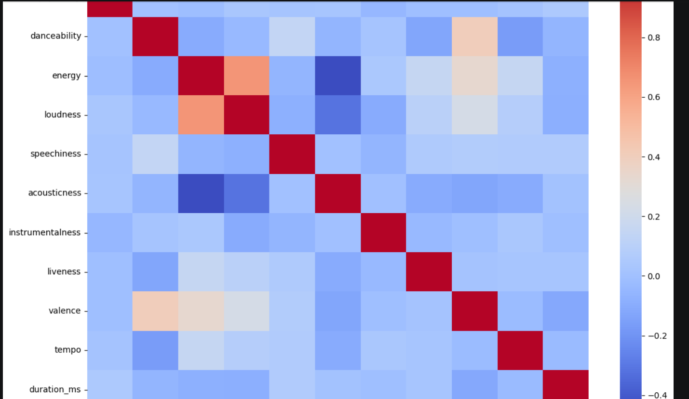
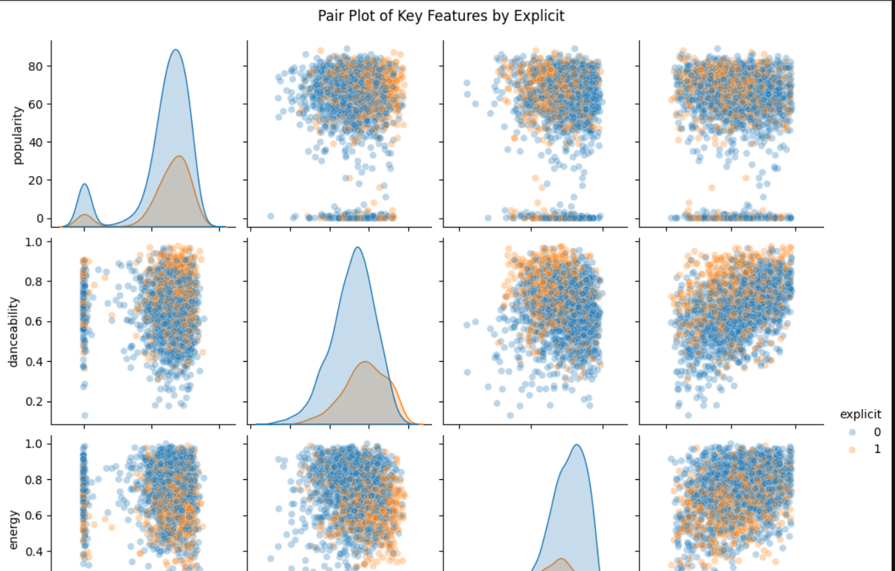
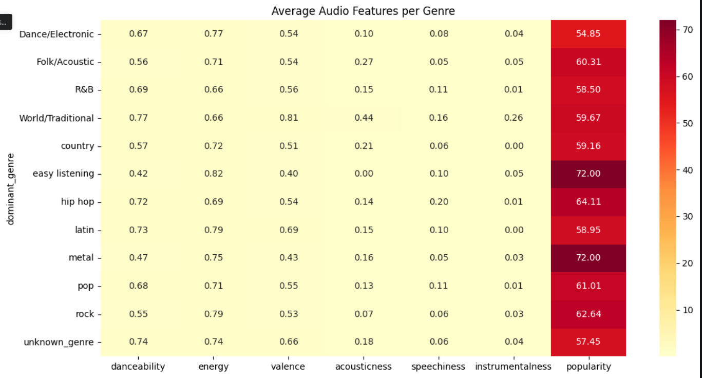
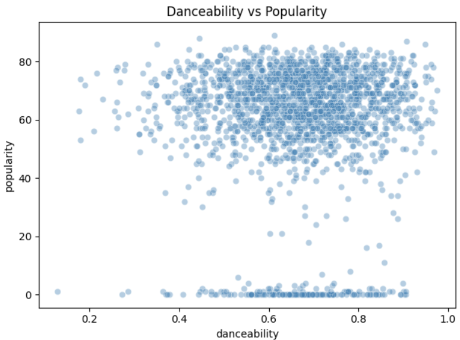
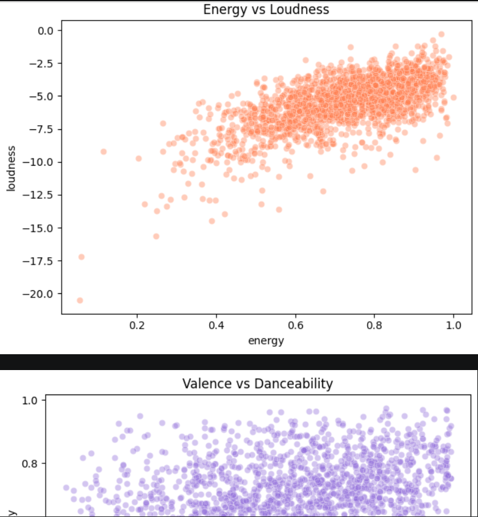
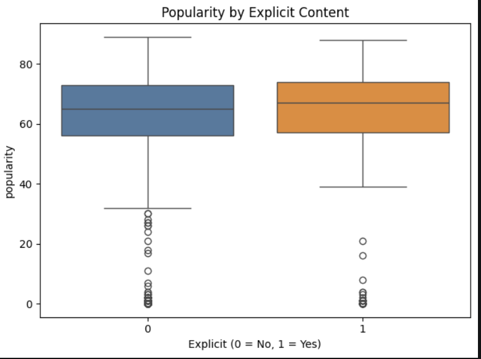
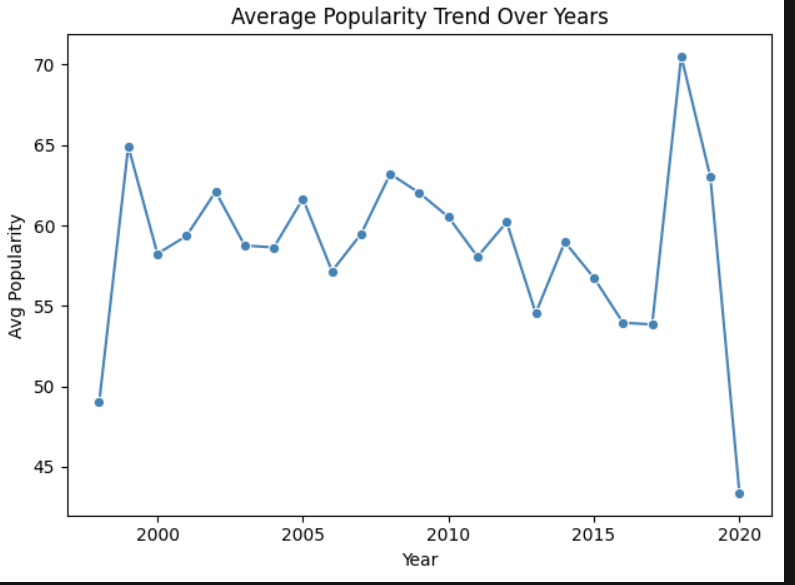

# Spotify Top Tracks Audio Feature Analysis

## Overview

This project analyzes 2,000 Spotify tracks from 1998–2020 to understand how audio features influence song popularity. The project follows a complete data analytics workflow including data cleaning, preprocessing, feature engineering, exploratory data analysis (EDA), visualization, encoding, and scaling.

## Team Members

* Snigdha Singh
* Shaury Tandon

## Objectives

* Analyze Spotify audio features and popularity trends
* Perform data cleaning and preprocessing
* Apply feature engineering techniques
* Explore relationships between audio characteristics
* Generate insights using visualizations and statistical analysis

## Technologies Used

* Python
* Pandas
* NumPy
* Matplotlib
* Scikit-learn
* Jupyter Notebook

## Workflow

1. Data Acquisition
2. Data Cleaning and Preprocessing
3. Missing Value Handling
4. Feature Engineering
5. Label Encoding and One-Hot Encoding
6. Feature Scaling
7. Exploratory Data Analysis (EDA)
8. Correlation Analysis
9. Data Visualization
10. Insight Generation

## Project Visualizations

Some visualizations generated during the analysis are available in the `images` folder.
## Sample Visualizations

## Sample Visualizations

### Visualization 1

### Visualization 2

### Visualization 3

### Visualization 4

### Visualization 5

### Visualization 6

### Visualization 7

## Key Findings

* Popularity showed very weak correlation with most audio features.
* Energy and loudness exhibited a strong positive relationship.
* Genre had a greater influence on popularity than individual audio features.
* Hip-hop and rock tracks showed the highest average popularity.
* Audio features alone were not sufficient predictors of track popularity.

## Repository Contents

* `spotify_analysis.ipynb` – Complete project notebook
* `Spotify_Project_Report.pdf` – Detailed project report
* `dataset.csv` – Dataset used for analysis
* `images/` – Visualizations and project screenshots

## Future Improvements

* Build predictive machine learning models for popularity estimation
* Expand analysis using larger Spotify datasets
* Integrate Spotify API for real-time data collection
* Compare trends across different time periods and genres

